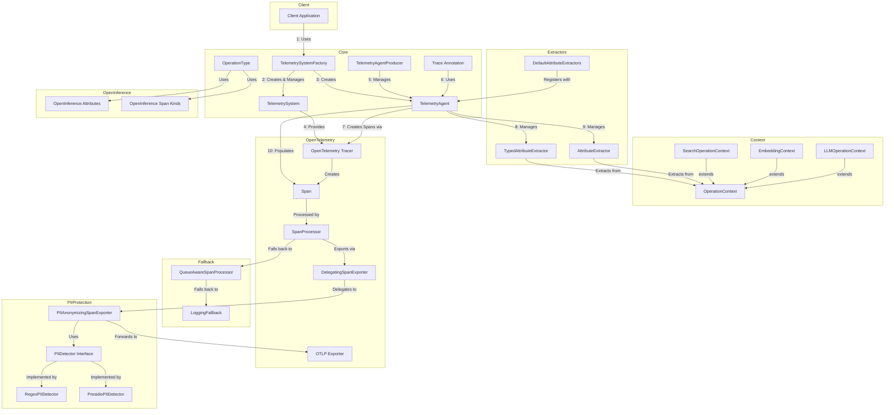

# AI OpenTelemetry Exporter Architecture

This document provides a high-level overview of the AI OpenTelemetry Exporter library architecture and component
relationships.

## Component Flow Diagram



## Component Descriptions

### Core Components

- **TelemetrySystemFactory**: Central registry that creates and manages TelemetrySystem instances for different service/tenant combinations
- **TelemetrySystem**: Creates and configures tenant-specific OpenTelemetry components, including tracers and exporters
- **TelemetryAgentProducer**: Provides CDI-managed TelemetryAgent instances and handles registration of extractors across all agents
- **TelemetryAgent**: Central component that manages span creation, attribute extraction, and telemetry data collection for a specific tenant
- **Trace Annotation**: Annotation for automatic span creation around methods, uses the TelemetryAgent internally
- **OperationType**: Enum defining supported operation types (EMBEDDING, SEARCH, LLM) with attribute mappings

### Extractors

- **TypedAttributeExtractor**: Interface for extracting attributes from specific response types
- **AttributeExtractor**: Interface for extracting attributes from GenericResponse types
- **DefaultAttributeExtractors**: Provides default extractors for common response types

### Context

- **OperationContext**: Base interface for operation-specific context information
- **SearchOperationContext**: Context for search operations with query and endpoint information
- **EmbeddingContext**: Context for embedding operations with model and text information
- **LLMOperationContext**: Context for LLM operations with prompt and model information

### OpenTelemetry

- **OpenTelemetry Tracer**: Creates and manages spans
- **Span**: Represents a single operation in a trace
- **SpanProcessor**: Processes spans before export
- **DelegatingSpanExporter**: Chain of responsibility pattern for span exporters to modify spans before final export
- **OTLP Exporter**: Exports spans to an OpenTelemetry collector

### OpenInference

- **OpenInferenceAttributes**: Constants for standardized OpenInference attribute names
- **OpenInferenceSpanKinds**: Defines standardized span kinds for AI operations (RETRIEVER, EMBEDDING, etc.)

### Fallback

- **QueueAwareSpanProcessor**: Processes spans with a queue-based approach and monitors queue health
- **LoggingFallback**: Falls back to logging when queue is full

### PII Protection

- **PIIAnonymizingSpanExporter**: Wraps any SpanExporter to anonymize PII in span attributes before export
- **PIIDetector**: Interface for detecting and anonymizing PII in text
- **RegexPIIDetector**: Implements PIIDetector using regular expressions for common PII patterns
- **PresidioPIIDetector**: Implements PIIDetector using Microsoft Presidio for advanced PII detection

## Flow Description

1. Client applications use the `TelemetrySystemFactory` to get or create systems for their service/tenant
2. The `TelemetrySystemFactory` acts as a factory to create tenant-specific `TelemetrySystem` instances
3. The `TelemetrySystem` configures the `OTelTracer` and `SpanProcessor` components
4. The `TelemetryAgentProducer` manages lifecycle of `TelemetryAgent` instances in CDI environments
5. Client applications use the `@Trace` annotation on methods that need to be traced
6. The `@Trace` annotation internally uses the `TelemetryAgent` to create and manage spans
7. The `TelemetryAgent` requests spans from the OpenTelemetry Tracer
8. The OpenTelemetry Tracer creates the spans
9. The `TelemetryAgent` populates spans with attributes using type-specific extractors
10. The `OperationType` enum maps logical attribute names to OpenInference attribute keys
11. Spans are processed by the `SpanProcessor` and sent through the exporter chain
12. The `DelegatingSpanExporter` allows multiple exporters to modify the spans in a chain
13. The `PIIAnonymizingSpanExporter` scans span attributes for PII using configured detectors
14. Detected PII is anonymized using either regex patterns or Presidio services
15. Anonymized spans are forwarded to the OTLP Exporter for transmission
16. In high-throughput scenarios, the `QueueAwareSpanProcessor` provides a fallback mechanism
17. If the queue is full, spans are logged via the `LoggingFallback`

## Integration Example

```java
// Create and configure the telemetry system
TelemetrySystem telemetrySystem = TelemetrySystemFactory.getConfiguration(
    "my-service", 
    "tenant-1");

// Get a tenant-specific TelemetryAgent
TelemetryAgent telemetryAgent = TelemetrySystemFactory.createAgent(
    "my-service", 
    "tenant-1");

// Register a custom extractor for search responses
CustomSearchAttributeExtractor searchExtractor = 
    new CustomSearchAttributeExtractor();

// Register with the TelemetryAgent
telemetryAgent.registerTypedExtractor(
    OperationType.SEARCH,
    SearchResponse.class,
    searchExtractor);

// Use the @Trace annotation for automatic span creation
// The annotation will use the TelemetryAgent internally
@Trace(
    spanName = "search_operation",
    spanKind = SpanKind.CLIENT,
    operationType = OperationType.SEARCH,
    responseType = SearchResponse.class
)
public SearchResponse<Document> search(Query query) {
    // Method implementation
}
```

## PII Protection Example

```java
// Create a custom PII detector configuration
PIIDetectorConfig piiConfig = new PIIDetectorConfig();

// Enable both regex and Presidio detection
piiConfig.setRegexDetectionEnabled(true);
piiConfig.setPresidioDetectionEnabled(true);

// Configure Presidio endpoints
piiConfig.setPresidioAnalyzerEndpoint("http://presidio-analyzer:3000/analyze");
piiConfig.setPresidioAnonymizerEndpoint("http://presidio-anonymizer:3001/anonymize");

// Add custom regex patterns for domain-specific PII
piiConfig.addRegexPattern("\\b[A-Z]{2}\\d{6}[A-Z]\\b", "[PASSPORT_NUMBER]");
piiConfig.addRegexPattern("\\b\\d{5}(-\\d{4})?\\b", "[ZIP_CODE]");

// Get a telemetry system with the custom PII config
// Register the PII anonymizing exporter
PIIAnonymizingSpanExporter piiExporter = TelemetrySystem.registerExporter(
    new PIIAnonymizingSpanExporter(piiConfig));

// The PIIAnonymizingSpanExporter is automatically configured
// and will use both regex and Presidio detection
```